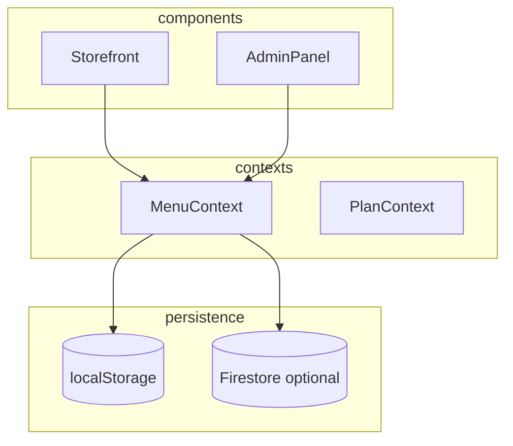

# Trufi docs index

Agent manifest: read this first, then one targeted file.

| Need | Read |
|------|------|
| System overview | [architecture.md](./architecture.md) |
| Product tiers | [features/plans-tiers.md](./features/plans-tiers.md) |
| Cart, checkout, WhatsApp | [features/ordering-checkout.md](./features/ordering-checkout.md) |
| Order inbox, status | [features/orders-admin.md](./features/orders-admin.md) |
| MercadoPago | [features/payments-mercadopago.md](./features/payments-mercadopago.md) |
| Promos, reports | [features/promotions-reports.md](./features/promotions-reports.md) |
| AI chat | [features/ai-assistant.md](./features/ai-assistant.md) |
| Firebase, tenants | [features/firebase-tenants.md](./features/firebase-tenants.md) |
| Menu photo import | [features/menu-onboarding.md](./features/menu-onboarding.md) |
| i18n, branding, analytics | [features/i18n-branding-analytics.md](./features/i18n-branding-analytics.md) |
| Storefront UI | [components/storefront.md](./components/storefront.md) |
| Checkout, share, footer | [components/checkout-share-footer.md](./components/checkout-share-footer.md) |
| Admin panel | [components/admin-panel.md](./components/admin-panel.md) |
| Contexts | [modules/contexts.md](./modules/contexts.md) |
| Services | [modules/services.md](./modules/services.md) |
| Plans, types | [modules/config-types.md](./modules/config-types.md) |
| Utils | [modules/utils.md](./modules/utils.md) |
| Vercel API | [api/vercel-functions.md](./api/vercel-functions.md) |
| Env vars | [ops/env-vars.md](./ops/env-vars.md) |
| Firebase production | [ops/firebase-setup.md](./ops/firebase-setup.md) |
| Production smoke test | [ops/smoke-test.md](./ops/smoke-test.md) |
| **Prospect demo (3 min)** | [ops/prospect-demo.md](./ops/prospect-demo.md) |
| **30-day sales audit + Demo Express decision** | [ops/audit-sales-30-days-2026-07-11.md](./ops/audit-sales-30-days-2026-07-11.md) |
| **Monday ship (deploy → demo)** | [ops/monday-deploy-checklist.md](./ops/monday-deploy-checklist.md), [monday-smoke-runbook.md](./ops/monday-smoke-runbook.md), [monday-demo-script.md](./ops/monday-demo-script.md) |
| **Go-live / overnight report** | [ops/go-live-report.md](./ops/go-live-report.md) |
| Tablet armado | [ops/tablet-armado.md](./ops/tablet-armado.md) |
| Zona Norte pilots | [ops/pilot-program-zn.md](./ops/pilot-program-zn.md) |
| Pilot shop A / B | [ops/pilot-shop-a.md](./ops/pilot-shop-a.md), [pilot-shop-b.md](./ops/pilot-shop-b.md) |
| Pilot metrics sheet | [ops/pilot-metrics.md](./ops/pilot-metrics.md) |
| Case study + sales 5 | [ops/case-study-template.md](./ops/case-study-template.md), [sales-playbook-zn.md](./ops/sales-playbook-zn.md) |
| **Leads anillos (Olivos→VL)** | [ops/leads-rings-routine.md](./ops/leads-rings-routine.md) |
| Client onboarding | [ops/onboarding.md](./ops/onboarding.md) |
| Live demo script | [ops/demo.md](./ops/demo.md) |
| Human portfolio | [human/portfolio.md](./human/portfolio.md) |
| **Roadmap / future** | [roadmap/README.md](./roadmap/README.md) |
| **Orders v2 (Hito 1+)** | [roadmap/order-processing-v2.md](./roadmap/order-processing-v2.md) |
| **Demo carnicería Gabriel (Hito 1)** | [roadmap/demo-carniceria-gabriel.md](./roadmap/demo-carniceria-gabriel.md) |

