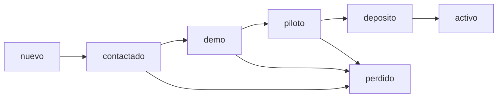

# MVP CRM/BPM — scope thin

## In scope

| Módulo | Función |
|--------|---------|
| **Leads** | CRUD + búsqueda por tier/fit/status |
| **Pipeline** | Etapas con fecha último contacto |
| **Notas** | Texto libre + timestamp (no chat WSP) |
| **Links** | `demo_url`, `tenant_url` — abrir en nueva pestaña |
| **Next action** | Fecha + texto (“llamar martes 15h”) |
| **Import** | CSV desde `leads-scan` o pegar tabla manual |

## Out of scope (queda en Tmm-store)

- Storefront, carrito, checkout, panel pedidos
- Firebase provisioning UI (usar `/super-admin` existente)
- Mercado Pago, webhooks, AI menu import
- WhatsApp Business API / inbox unificado
- Multi-user RBAC complejo

## Etapas BPM (orden)

| Etapa | Criterio salida |
|-------|-----------------|
| nuevo | En lista, sin contacto |
| contactado | WSP/llamada/IG — pitch enviado |
| demo | Link demo enviado + fecha demo |
| piloto | Interés verbal, sin depósito |
| deposito | 50% implementación cobrado |
| activo | Tenant live `/s/:slug` entregado |
| perdido | No responde / no fit / competidor cerrado |

## Pantallas mínimas

1. **Dashboard** — conteo por etapa + “hoy: next actions”
2. **Lead detail** — campos + notas + links
3. **Import** — pegar CSV o subir salida scan

## Métricas (manual OK)

- Contactos/día por tier
- Demo → depósito %
- Tiempo medio nuevo → activo
