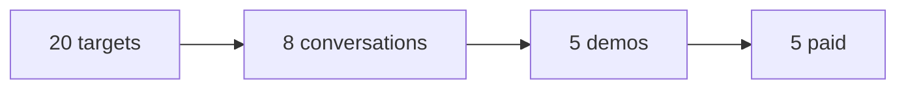

# Sales playbook — 5 shops same zona

Purpose: after 2 happy pilots, close 5 paid Pedidos in Zona Norte / CABA.

## Funnel

## Target list (20)

Seed + anillos: [`leads-rings-routine.md`](./leads-rings-routine.md) (T0 Olivos → T1 VL, 100+ reviews, sin web).

| # | Shop | Barrio | Contact | PD? | Status |
|---|------|--------|---------|-----|--------|
| 1 | | | | | |
| … | | | | | |
| 20 | | | | | |

**Profile:** rotisería, chori, empanadas, food truck — owner = cook, alto WSP.

## Pitch (30 sec)

Sin comisión por pedido. Tus clientes piden por la web, vos ves todo en el celular, imprimís cocina y respondés WSP con un toque. Armamos todo sin cargo. Menos que PedidoDirecto.

## Objections

| Objection | Response |
|-----------|----------|
| "Ya uso PedidoDirecto" | "¿Cuánto pagás fijo? Nosotros [precio] + 0 comisión. Probá 1 mes." |
| "Mis clientes no piden online" | "Siguen por WSP — nosotros ordenamos el mensaje y el #pedido." |
| "No quiero pagar ahora" | Pilot 3 meses gratis si referís otro local (post-MVP Gaucho track)." |

## Demo flow (10 min)

1. Customer: `/demo/pizzeria` → carta → carrito → pedido de prueba
2. Admin: `/demo/pizzeria/owner` → sonido → ticket → Nuevo→Prep→Listo
3. Badge **Nube** — celular + PC sync (tenant real)
4. Precio: $15–18k/mes vs PD $20k

## Close checklist

- [ ] Verbal OK + fecha go-live
- [ ] Tenant slug + Vercel env
- [ ] Onboarding → [`onboarding.md`](./onboarding.md)
- [ ] Smoke → [`smoke-test.md`](./smoke-test.md)
- [ ] Case study filed → [`case-study-template.md`](./case-study-template.md)

## Success

**5 paid shops** in same zona → MVP sales phase complete. Then evaluate Gaucho for leads who won't pay upfront.

See also: [`pilot-program-zn.md`](./pilot-program-zn.md)
