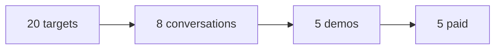

# Sales playbook — 5 shops same zona

Purpose: after 2 happy pilots, close 5 paid shops in Zona Norte / CABA.

## Funnel

## Two sales lanes

### A. Pedidos / gastronomía

Best for rotisería, chori, empanadas, food truck — owner = cook, alto WSP.

Pitch: **0 comisión por pedido.** Tus clientes piden por la web, vos ves todo en el celular, imprimís cocina y respondés WSP con un toque.

### B. Catálogo / retail local

Best for shops with visible inventory but weak/no ecommerce: ropa, calzado, lencería, regalos/deco, cotillón, juguetería, óptica, pet, flores, dietética, deportes.

Pain signals:

- Instagram is acting as the catalog.
- Repeated WhatsApp questions: precio, talle, color, stock, medios de pago.
- No website, stale website, or disabled online store.
- Owner/staff manually sends many product photos.
- Product assortment changes often enough that a printable catalog goes stale.

Pitch: **"Te ordeno el catálogo para que no tengas que mandar 20 fotos por WhatsApp. El cliente ve productos, variantes y precios; después compra o te escribe ya sabiendo qué quiere."**

## Olivos retail targets — 2026-08-18

Prioritize independents. Verify current web/IG before contact; the list is a prospecting queue, not a claim that they need the product.

| Priority | Shop | Rubro | Address | Why worth checking | Status |
|---|---|---|---|---|---|
| A | Casa Sánchez Desde 1961 | ropa / lencería | Av. Maipú 2302 | established local shop; delivery; directory reports Instagram but no website | Visit / IG |
| A | Agnes B Cotillón y Repostería | cotillón / repostería | Gdor. M. Ugarte 1694 | high-variety visual inventory; delivery; directory reports Instagram but no website | Visit / IG |
| A | No soy yo sos vos | ropa mujer | Ricardo Gutiérrez 1509 | existing Empretienda currently appears disabled — strong reactivation pitch | Visit / IG |
| A | Calzados Sarachian | calzado | Av. Maipú 2339 | classic neighborhood shoe shop; catalog/talle use case; no strong ecommerce surfaced | Visit |
| A | Calzados Morelli | calzado | Av. Maipú 2335 | immediately next to Sarachian; same demo can sell both | Visit |
| A | CoCo & Deco | deco / regalos / bazar | Av. Maipú 3020 | highly visual assortment; catalog is natural product | Visit / IG |
| B | Collectoy's Tienda de Comics | comics / juguetes | Av. Maipú 3849 | collectible inventory + new arrivals; strong catalog/search use case | Visit / IG |
| B | Di Cards / DC Ideas | cotillón / papelera | Carlos Gardel 1899 | broad inventory and events use case; same demo family as Agnes B | Visit / IG |
| B | Óptica Olivos | óptica | Av. Maipú 2517 | frames are visual inventory; WhatsApp qualification can be simplified | Visit / IG |
| B | Pipon Mascotas Pet Shop | pet shop | Carlos Gardel 1708 | repeat purchases + existing petshop demo gives near-zero demo cost | Visit / IG |
| B | Ideas en Flor | florería | Domingo de Acassuso 900 | visual catalog + occasion bundles + WhatsApp ordering | Visit / IG |
| B | Natural Olivos Dietética | dietética | Ricardo Gutiérrez 1217 | repeat products and bundles; simple catalog/order flow | Visit |

### Deprioritize for now

- **Luisiana Boutique** — already has a substantial ecommerce site.
- **Marem Tienda de Regalos** — has its own web domain.
- **Oculus Óptica** — already has a Webflow website.
- **Perfumerías Pigmento / chains** — decision maker is less likely to be standing in the local branch.

## Efficient walking clusters

### Maipú 2300–2800

One reusable retail demo can cover several stops:

1. Casa Sánchez — 2302
2. Calzados Morelli — 2335
3. Calzados Sarachian — 2339
4. Óptica Olivos — 2517
5. Zapatería Febo — 2798 (lower priority if chain/centralized decisions)

### Ugarte / nearby

1. Agnes B — Ugarte 1694
2. Di Cards — Carlos Gardel 1899
3. Pipon Mascotas — Carlos Gardel 1708

## Demo backlog by leverage

Build once, reuse many times:

1. **Moda / calzado** — grid, talles, colores, stock, WhatsApp from product.
2. **Regalos / deco / cotillón** — categories, search, bundles, seasonal items.
3. **Óptica** — frames + brands + "consultar por receta" rather than blind checkout.
4. **Floristería** — occasions, budget tiers, delivery date.

Do not build one bespoke demo per lead until they show interest. Use one vertical demo and personalize logo/hero in minutes.

## Target list (20)

Seed + anillos: [`leads-rings-routine.md`](./leads-rings-routine.md) (T0 Olivos → T1 VL, 100+ reviews, sin web).

| # | Shop | Barrio | Contact | Product | Status |
|---|------|--------|---------|---------|--------|
| 1 | Casa Sánchez | Olivos | 011 4799-3930 | Catálogo | Prospect |
| 2 | Agnes B | Olivos | 011 2197-9464 | Catálogo | Prospect |
| 3 | No soy yo sos vos | Olivos | IG / local | Catálogo | Prospect |
| 4 | Calzados Sarachian | Olivos | 011 4790-4558 | Catálogo | Prospect |
| 5 | Calzados Morelli | Olivos | 011 4790-6009 | Catálogo | Prospect |
| 6 | CoCo & Deco | Olivos | local | Catálogo | Prospect |
| 7 | Collectoy's | Olivos | 011 4799-8597 | Catálogo | Prospect |
| 8 | Di Cards | Olivos | 011 5803-3519 | Catálogo | Prospect |
| 9 | Óptica Olivos | Olivos | 011 6435-0868 | Catálogo | Prospect |
| 10 | Pipon Mascotas | Olivos | 011 4794-7749 | Catálogo | Prospect |
| 11 | Ideas en Flor | Olivos | 011 6946-8023 | Catálogo | Prospect |
| 12 | Natural Olivos Dietética | Olivos | 011 6213-0929 | Catálogo | Prospect |
| 13 | | | | | |
| 14 | | | | | |
| 15 | | | | | |
| 16 | | | | | |
| 17 | | | | | |
| 18 | | | | | |
| 19 | | | | | |
| 20 | | | | | |

## Objections

| Objection | Response |
|-----------|----------|
| "Ya uso PedidoDirecto" | "¿Cuánto pagás fijo? Nosotros [precio] + 0 comisión. Probá 1 mes." |
| "Vendo todo por Instagram" | "Perfecto: Instagram trae gente. El catálogo evita que tengan que buscar el producto entre posteos o preguntarte precio/talle por WSP." |
| "Mis clientes me escriben igual" | "Mejor: llegan al chat con producto, variante y precio ya elegidos." |
| "No quiero mantener otra cosa" | "La carga tiene que ser móvil y simple; arrancamos nosotros con tu catálogo." |
| "No quiero pagar ahora" | "Arranquemos con la demo y medimos si te ahorra consultas o genera pedidos antes de ampliar." |

## Demo flow (10 min)

### Gastronomía

1. Customer: `/demo/pizzeria` → carta → carrito → pedido de prueba
2. Admin: `/demo/pizzeria/owner` → sonido → ticket → Nuevo→Prep→Listo
3. Badge **Nube** — celular + PC sync (tenant real)

### Retail

1. Open vertical demo from QR on phone.
2. Browse 2–3 categories and one product with variants.
3. Tap WhatsApp / cart with the exact product already identified.
4. Show owner how product/stock/price can be edited from mobile.
5. Close on catalog first; upsell checkout/order admin only if useful.

## Close checklist

- [ ] Verbal OK + fecha go-live
- [ ] Tenant slug + Vercel env
- [ ] Onboarding → [`onboarding.md`](./onboarding.md)
- [ ] Smoke → [`smoke-test.md`](./smoke-test.md)
- [ ] Case study filed → [`case-study-template.md`](./case-study-template.md)

## Success

**5 paid shops** in same zona → MVP sales phase complete. Then evaluate Gaucho for leads who won't pay upfront.

See also: [`pilot-program-zn.md`](./pilot-program-zn.md)
