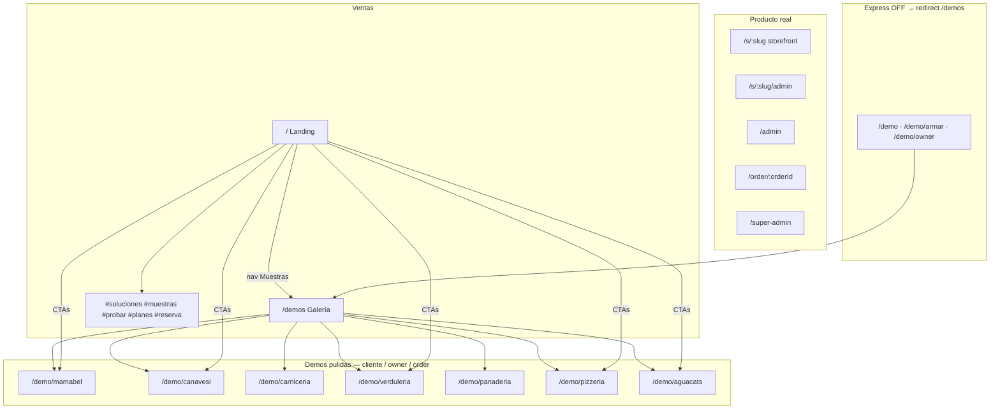

# Mapa sitio — Gatrivi.com

Fecha: 2026-08-06 · v1.22.x · live `https://tmm.gatrivi.com`

## Árbol

## Landing `/`

| Ancla | Qué |
|-------|-----|
| `#hero` | Hero + fotos fondo |
| `#soluciones` | Catálogo → Canavesi · Landing → Mabel · Tienda → Pizza |
| `#muestras` | Links demos |
| `#probar` | CTA → `/demos` |
| `#planes` · `#reserva` | Precios / contacto |

`/pricing` → `/#planes`

## Demos pulidas

Cada una: cliente · `/owner` · `/order/:id`

| Marca | Path |
|-------|------|
| Mamá Mabel | `/demo/mamabel` |
| Canavesi | `/demo/canavesi` |
| Gabriel | `/demo/carniceria` |
| La Inmaculada | `/demo/verduleria` |
| La Magdalena | `/demo/panaderia` |
| Pizzería | `/demo/pizzeria` |
| Aguacats | `/demo/aguacats` |

Alias: `/demo/mamamabel` → mamabel

## Tenants reales

`/s/:slug` · `/s/:slug/admin` · `/admin` · `/order/:id` · `/super-admin`

## Express ON (fotos completas en `public/demos/presets/`)

`DEMO_EXPRESS_PUBLIC=true` · `/demo?rubro=<id>` · `/demo/armar` OFF

| Rubro | URL |
|-------|-----|
| Cafetería | `/demo?rubro=cafeteria` |
| Librería | `/demo?rubro=libreria` |
| Pet shop | `/demo?rubro=petshop` |
| Pollería | `/demo?rubro=polleria` |
| Gráfica | `/demo?rubro=grafica` |
| Lácteos | `/demo?rubro=distribuidora-lacteos` |
| Molino Florida | `/demo?rubro=molino-mayorista&negocio=Molino%20Florida` |

Verdulería preset duplicada → usar `/demo/verduleria`.

## Sin preset / sin fotos (no rehabilitar)

Rubros en `PROSPECT_CATEGORIES` sin preset: `gastronomia`, `rotiseria`, `almacen`, `dietetica`.  
`/demo` legacy choripán solo si Express legacy activo.

## Relacionado

- [`AGENT_STATUS.md`](../AGENT_STATUS.md)
- [`prospect-demo.md`](./prospect-demo.md)
- [`vertical-demos-plan.md`](../roadmap/vertical-demos-plan.md)
