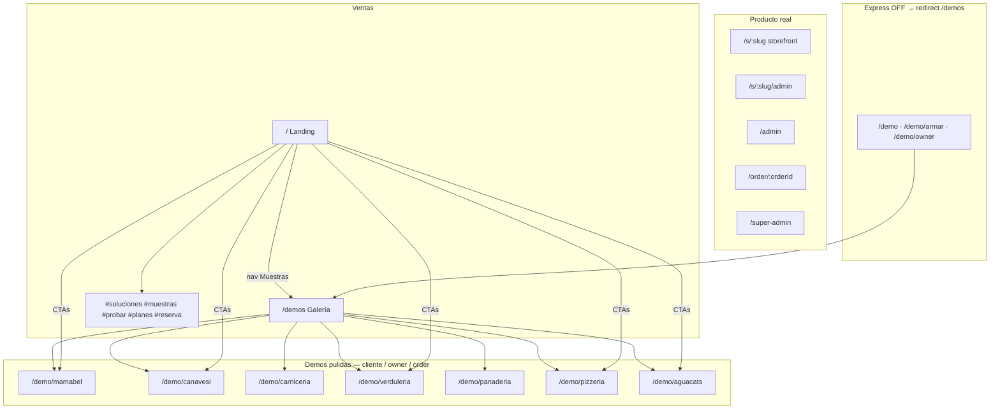

# Mapa sitio — Gatrivi.com

Fecha: 2026-08-06 · v1.22.x · live `https://tmm.gatrivi.com`

## Árbol

## Landing `/`

| Ancla | Qué |
|-------|-----|
| `#hero` | Hero + fotos fondo |
| `#soluciones` | Catálogo → Canavesi · Landing → Mabel · Tienda → Pizza |
| `#muestras` | Links demos |
| `#probar` | CTA → `/demos` |
| `#planes` · `#reserva` | Precios / contacto |

`/pricing` → `/#planes`

## Demos pulidas

Cada una: cliente · `/owner` · `/order/:id`

| Marca | Path |
|-------|------|
| Mamá Mabel | `/demo/mamabel` |
| Canavesi | `/demo/canavesi` |
| Gabriel | `/demo/carniceria` |
| La Inmaculada | `/demo/verduleria` |
| La Magdalena | `/demo/panaderia` |
| Pizzería | `/demo/pizzeria` |
| Aguacats | `/demo/aguacats` |

Alias: `/demo/mamamabel` → mamabel

## Tenants reales

`/s/:slug` · `/s/:slug/admin` · `/admin` · `/order/:id` · `/super-admin`

## Express OFF (código vivo, no público)

Flag: `src/config/demoExpress.ts` → `DEMO_EXPRESS_PUBLIC=false`

`/demo` · `/demo?rubro=*` · `/demo/armar` · `/demo/owner` → `/demos`

Presets con assets (incl. café): `public/demos/presets/<rubro>/` · data `src/data/demoPresets.ts`

| Preset | Assets |
|--------|--------|
| `cafeteria` | espresso, café leche, capuccino, medialuna, tostado, desayuno, jugo, agua |
| `molino-mayorista` | Molino Florida |
| `petshop` · `libreria` · `polleria` · `grafica` · `distribuidora-lacteos` · … | idem |

**Hueco demos pulidas:** cafetería / café takeaway (assets Express listos; falta vertical `/demo/cafe` si hay lead).

## Relacionado

- [`AGENT_STATUS.md`](../AGENT_STATUS.md)
- [`prospect-demo.md`](./prospect-demo.md)
- [`vertical-demos-plan.md`](../roadmap/vertical-demos-plan.md)
