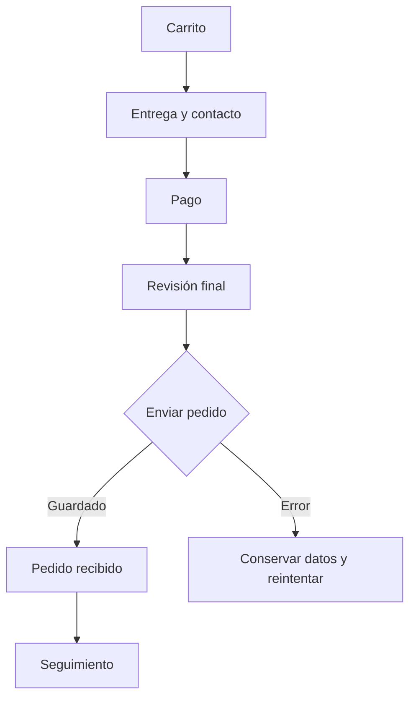
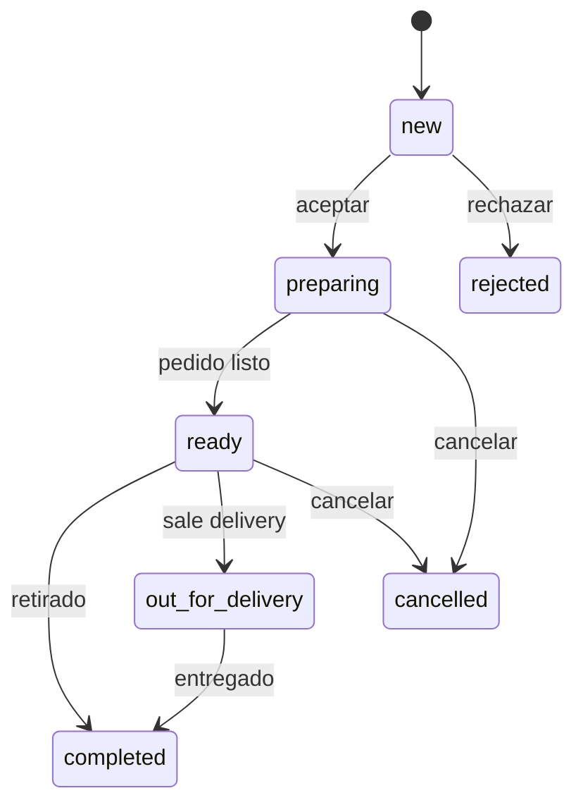

# TMM Store — sistema de pedidos v2

Brief de producto e implementación para Cursor.

Estado auditado: rama `trabajo`, versión `1.6.0`, 21 de julio de 2026.

## 0. Instrucción para Cursor

Implementar por hitos. Empezar únicamente por el Hito 1 y detenerse cuando sus
criterios de aceptación estén verificados.

Reglas:

- No rediseñar la tienda, el menú, el branding ni la landing fuera de lo
  necesario para el flujo de pedidos.
- No crear botones, toggles o links sin comportamiento verificable.
- Si una función todavía no existe, ocultarla. No usar controles decorativos
  que parezcan interactivos.
- No confiar en precios, totales, estados de pago ni tenant enviados por el
  navegador.
- No usar `localStorage` como backend de un comercio real.
- Mantener el plan `menu` sin carrito, checkout, Mercado Pago ni pedidos.
- `pedidos` y `premium` comparten el mismo núcleo de pedidos. Premium podrá
  automatizarlo después, pero no debe tener otra máquina de estados.
- Un hito no está terminado hasta que su flujo principal funciona completo en
  390 px y escritorio, y pasan lint, build y las pruebas nuevas.

## 1. Resultado buscado

Un cliente arma el carrito, elige una opción realmente disponible, envía una
sola vez su pedido y recibe un seguimiento. El comercio lo ve inmediatamente
desde el celular y siempre tiene una única acción principal inequívoca.

La primera vertical comercial queda acotada a gastronomía y take-away de
Olivos, Vicente López, Zona Norte y CABA. Turnos, IA, facturación ARCA,
repartidores y logística pertenecen a otros módulos.

### Decisiones de producto

1. El pedido guardado es la fuente de verdad.
2. WhatsApp es aviso, contacto y fallback; no es la persistencia del pedido.
3. Mercado Pago es un medio de pago, no un estado del pedido.
4. Estado operativo y estado de pago son independientes.
5. Demo y producción usan los mismos tipos, componentes y transiciones.
6. Cada pantalla muestra solamente opciones configuradas y utilizables.

## 2. Diagnóstico actual

| Problema | Evidencia actual | Consecuencia | Decisión v2 |
| --- | --- | --- | --- |
| Demo desconectada | `CheckoutModal` no guarda pedidos para tenant `demo`; `DemoOwnerPage` usa otra interfaz y pedidos fijos | “Ver cómo lo recibe el local” muestra otro pedido | Repositorio demo en `sessionStorage` y componentes compartidos |
| Acciones duplicadas | `AdminOrders` muestra “Avanzar estado” y también “Aceptar” para un pedido nuevo | No queda claro qué botón usar | Una acción primaria nombrada por resultado |
| Detalle invisible en móvil | La lista y el detalle son columnas; en móvil el detalle aparece debajo de una lista con scroll | Tocar una orden puede parecer que no hizo nada | Abrir drawer/bottom sheet inmediato |
| Estados excesivos | `new → accepted → preparing` exige dos clics antes de cocinar | El estado se vuelve trabajo administrativo | `new → preparing` mediante “Aceptar y preparar” |
| Demo incompleta | “Listo para entregar” está deshabilitado y las métricas son fijas | El prospecto encuentra un callejón sin salida | Completar retiro/delivery y calcular métricas reales |
| Pago ambiguo | Efectivo y transferencia nacen siempre `pending`; el panel no muestra ni permite confirmar pago | No se sabe qué fue cobrado | Estado de pago separado y acción “Confirmar transferencia/cobro” |
| Opciones inventadas | Checkout siempre ofrece efectivo y transferencia; no existen configuraciones de entrega ni zonas | El cliente elige algo que el comercio quizá no ofrece | Mostrar únicamente opciones habilitadas y válidas |
| MP activable roto | El admin permite activar MP sin credenciales y anticipa que el error lo verá el cliente | Falla en el momento más caro del embudo | Readiness check; si no está listo, MP no aparece |
| Orden fantasma | Se guarda antes de abrir WhatsApp o crear preferencia MP; un error deja pedidos pendientes | Duplicados y órdenes que nadie terminó | Creación idempotente y reintento de handoff/pago sobre la misma orden |
| Total manipulable | `create-preference` recibe títulos y precios del navegador | Un cliente puede alterar el importe | Recalcular todo en servidor desde menú/configuración |
| Webhook inseguro | No valida `x-signature`; usa un único tenant de entorno | Pago falsificable o aplicado al tenant incorrecto | Firma obligatoria y referencia multi-tenant |
| Firestore abierto | `firestore.rules` permite lectura y escritura públicas | Cualquiera puede leer o modificar pedidos | Escritura por backend; lectura admin por rol y tenant |
| Seguimiento roto | `/order/:id` pierde el slug del tenant y hace una sola lectura | Puede no encontrar el pedido y no actualiza estados | Token público opaco y polling/suscripción |
| ID débil | ID aleatorio de cuatro caracteres sin control de colisión | Colisiones con volumen | ID interno fuerte + código humano separado |
| Carrito global | `elpuestito_cart` no incluye tenant | Un carrito puede cruzarse entre demos/locales | Clave `trufi_cart_v2_<tenantId>` |
| Métrica incorrecta | “Vendido hoy” suma rechazados, cancelados y no pagados | El panel informa ventas inexistentes | Cobrado = pedidos pagados no cancelados |

## 3. Flujo del cliente



### 3.1 Carrito

- Persistir por tenant.
- Revalidar disponibilidad y precio antes de checkout.
- Mostrar subtotal, descuento, costo de entrega y total como filas distintas.
- No permitir checkout si el local está cerrado o la configuración de pedidos
  está incompleta. Explicar el motivo al lado del CTA.

### 3.2 Entrega y contacto

Mostrar solo modalidades habilitadas:

- `Retiro en el local`: mostrar dirección y tiempo estimado.
- `Envío`: elegir una zona configurada, luego pedir calle y altura, piso/depto y
  referencia opcional.

Campos:

- Nombre.
- “Tu WhatsApp — te confirmamos el pedido acá”.
- Modalidad.
- Zona y domicilio, solo para envío.
- Notas del pedido, opcionales.

Para el primer piloto no usar geocoding ni cálculo por kilómetros. El comercio
define zonas simples, por ejemplo Olivos, La Lucila, Florida y Martínez, cada
una con costo y mínimo propios.

### 3.3 Pago

Mostrar únicamente métodos habilitados:

- Efectivo.
  - Estado inicial: `unpaid`.
  - Para delivery, aceptar “Pago justo” o “Pago con $...”.
- Transferencia.
  - Mostrar alias y botón Copiar.
  - Estado inicial: `pending` hasta confirmación del comercio.
  - No pedir comprobante en v1.
- Mercado Pago.
  - Mostrar solo si backend, credencial y webhook están listos.
  - Estado inicial: `pending`; solo el webhook puede marcarlo `paid`.

### 3.4 Revisión final

Resumen visible:

- Productos y variantes.
- Retiro o zona/domicilio.
- Medio de pago.
- Subtotal, descuento, envío y total.
- CTA único:
  - Efectivo/transferencia: `Enviar pedido`.
  - Mercado Pago: `Ir a pagar con Mercado Pago`.
- Link secundario: `Editar datos`.

El botón entra en estado `Enviando…`, queda deshabilitado y utiliza una clave de
idempotencia. Doble toque, refresh o reintento no pueden crear otra orden.

### 3.5 Confirmación

Mostrar confirmación únicamente después de persistir:

- `Pedido enviado #A7K4Q2`.
- Estado actual.
- Tiempo estimado del modo elegido.
- Botón primario `Ver estado del pedido`.
- Botón secundario `Avisar por WhatsApp` si existe número del local.

Limpiar el carrito solo después de una creación confirmada. Un fallo conserva
carrito y formulario.

## 4. Flujo del comercio

### 4.1 Bandeja móvil

Pantalla principal operativa, no dashboard analítico.

Filtros con cantidad:

- `Nuevos`.
- `Preparando`.
- `Listos`.
- `Finalizados`.

Cada tarjeta muestra:

- Antigüedad (`hace 4 min`) y número.
- Cliente.
- Primera línea del pedido y cantidad de ítems.
- `Retiro` o `Envío · Olivos`.
- Total.
- Badge de pago: `Sin cobrar`, `A confirmar`, `Pagado` o `Falló`.

Al tocar una tarjeta, abrir un bottom sheet en móvil y drawer en escritorio.
Nunca colocar el resultado del toque fuera del viewport.

### 4.2 Detalle

Orden visual:

1. Número, tiempo y estado.
2. Productos y notas, con las notas resaltadas.
3. Entrega y domicilio.
4. Pago y su acción independiente.
5. Una acción operativa primaria fija abajo.
6. Acciones secundarias en menú `Más`.

Acciones secundarias:

- Abrir WhatsApp del cliente.
- Copiar resumen.
- Imprimir ticket 58 mm.
- Rechazar o cancelar, con confirmación y motivo breve.
- Abrir seguimiento del cliente.

### 4.3 Acción primaria

No usar “Avanzar estado”. El botón debe anticipar exactamente qué ocurrirá.

| Estado | Retiro | Envío |
| --- | --- | --- |
| `new` | `Aceptar y preparar` | `Aceptar y preparar` |
| `preparing` | `Marcar listo para retirar` | `Marcar listo para enviar` |
| `ready` | `Marcar retirado` | `Marcar en camino` |
| `out_for_delivery` | No aplica | `Marcar entregado` |
| `completed` | Sin CTA primario | Sin CTA primario |
| `rejected` / `cancelled` | Sin CTA primario | Sin CTA primario |

Después de actualizar:

- Mostrar feedback inmediato y persistencia en curso.
- Deshabilitar el CTA mientras guarda.
- Si falla, restaurar el estado anterior y ofrecer `Reintentar`.
- Mostrar una acción contextual `Avisar por WhatsApp`; abrir el mensaje correcto
  para el nuevo estado, sin fingir que fue enviado automáticamente.

### 4.4 Pago en panel

El pago no avanza junto con la cocina.

| Método y estado | Acción del comercio |
| --- | --- |
| Efectivo `unpaid` | `Marcar cobrado` al recibirlo |
| Transferencia `pending` | `Confirmar transferencia` |
| Mercado Pago `pending` | Ninguna; esperar webhook |
| Mercado Pago `paid` | Mostrar `Pagado por MP` |
| Cualquier método `paid` | Sin acción |

Un comercio puede preparar una transferencia todavía pendiente; el sistema
debe advertir, no bloquear por defecto.

## 5. Máquina de estados



Estados operativos v2:

```ts
export type OrderStatus =
  | 'new'
  | 'preparing'
  | 'ready'
  | 'out_for_delivery'
  | 'completed'
  | 'rejected'
  | 'cancelled';
```

Compatibilidad:

- Leer `accepted` legado como `preparing`.
- Leer `delivered` legado como `completed`.
- No volver a escribir estados legados.
- Centralizar transiciones en `orderStateMachine.ts`; ningún componente debe
  calcular el siguiente estado por su cuenta.

Estados de pago:

```ts
export type PaymentStatus =
  | 'unpaid'
  | 'pending'
  | 'paid'
  | 'failed'
  | 'refunded';
```

## 6. Configuración del local

Extender `SiteSettings` con un bloque versionado:

```ts
export interface OrderingSettings {
  enabled: boolean;
  pickup: {
    enabled: boolean;
    address: string;
    etaMinutes: number;
  };
  delivery: {
    enabled: boolean;
    etaMinutes: number;
    zones: DeliveryZone[];
  };
  payments: {
    cash: boolean;
    transfer: boolean;
    mercadoPago: boolean;
  };
  whatsappNumber: string;
}

export interface DeliveryZone {
  id: string;
  name: string;
  enabled: boolean;
  fee: number;
  minimumOrder: number;
}
```

### Readiness

Crear un selector puro `getOrderingReadiness(settings, runtimeCapabilities)`.

Un local está listo para recibir pedidos cuando:

- Pedidos está habilitado.
- Hay al menos una modalidad completa.
- Hay al menos un medio de pago completo.
- El número de WhatsApp es válido para contacto.
- Existe persistencia cloud y backend disponibles.
- Si MP está habilitado, el servidor confirma credencial y webhook configurados.

El admin muestra un checklist concreto. La tienda no muestra opciones inválidas.
No permitir el estado “toggle encendido, falla en el cliente”.

### Salud mínima

- `GET /api/ordering-health?tenant=<slug>` devuelve únicamente capacidades
  booleanas públicas; nunca secretos.
- El admin distingue `Listo`, `Falta configurar` y `Sin conexión`.
- El plan `menu` ignora este bloque y sigue siendo solo carta.

## 7. Contrato de datos

Mantener snapshots: un cambio futuro de nombre o precio del menú no debe alterar
un pedido histórico.

```ts
export interface OrderRecordV2 {
  schemaVersion: 2;
  id: string;
  publicCode: string;
  publicTokenHash: string;
  idempotencyKey: string;
  tenantId: string;
  source: 'storefront' | 'demo' | 'admin';
  status: OrderStatus;
  customer: {
    name: string;
    whatsappE164: string;
  };
  fulfillment: {
    type: 'pickup' | 'delivery';
    zoneId?: string;
    zoneName?: string;
    address?: {
      streetAndNumber: string;
      floorApartment?: string;
      references?: string;
    };
    etaMinutes: number;
  };
  payment: {
    method: 'cash' | 'transfer' | 'mercadopago';
    status: PaymentStatus;
    cashTendered?: number;
    providerPaymentId?: string;
    confirmedAt?: string;
  };
  items: OrderLineItemV2[];
  money: {
    currency: 'ARS';
    subtotal: number;
    discount: number;
    deliveryFee: number;
    total: number;
  };
  promoCode?: string;
  notes?: string;
  statusHistory: OrderStatusEvent[];
  createdAt: string;
  updatedAt: string;
}

export interface OrderLineItemV2 {
  itemId: string;
  itemName: string;
  optionId: string;
  optionLabel: string;
  unitPrice: number;
  quantity: number;
  lineTotal: number;
}

export interface OrderStatusEvent {
  from: OrderStatus | null;
  to: OrderStatus;
  at: string;
  actor: 'customer' | 'merchant' | 'system';
  reason?: string;
}
```

El token público se entrega una sola vez al cliente. Guardar su hash, no el token
plano, si la API de seguimiento lo permite sin complicar el piloto.

## 8. Backend y persistencia

### 8.1 Repositorio

Crear una interfaz única:

```ts
export interface OrderRepository {
  create(input: CreateOrderInput):
    Promise<CreateOrderResult>;
  subscribeActive(
    tenantId: string,
    callback: (orders: OrderRecordV2[]) => void,
  ): () => void;
  transition(
    orderId: string,
    to: OrderStatus,
  ): Promise<OrderRecordV2>;
  updatePayment(
    orderId: string,
    to: PaymentStatus,
  ): Promise<OrderRecordV2>;
}
```

Adaptadores:

- `DemoOrderRepository`: `sessionStorage`, solo `/demo`, compartido entre
  storefront y owner demo.
- `ProductionOrderRepository`: API para crear; Firestore autenticado para inbox
  en tiempo real y mutaciones autorizadas.
- `localStorage` puede seguir como herramienta de desarrollo explícita, nunca
  como fallback silencioso en producción.

### 8.2 API mínima

1. `POST /api/orders`
   - Recibe IDs, cantidades, datos del cliente, modalidad, zona, método y
     `idempotencyKey`.
   - Resuelve tenant por slug permitido, no por un valor arbitrario.
   - Carga menú, promociones y settings del servidor.
   - Revalida stock/disponibilidad y recalcula importes.
   - Crea una sola orden por `tenantId + idempotencyKey`.
   - Devuelve código, token de seguimiento y, si corresponde, intención de pago.
2. `POST /api/orders/:id/mp-preference`
   - Recibe solo referencia de orden.
   - Construye la preferencia desde la orden guardada.
   - Reutiliza preferencia válida en reintentos.
3. `GET /api/orders/public/:token`
   - Devuelve una vista sanitizada, nunca teléfono completo ni domicilio
     detallado.
4. Mutaciones del comercio
   - Autenticadas con Firebase Auth.
   - Verifican membresía y `tenantId` antes de modificar.

### 8.3 Seguridad obligatoria

- Sustituir el login local SHA-256 por Firebase Auth antes de un piloto real.
- Registrar membresía por tenant y rol (`owner`, `staff`).
- Firestore:
  - Público: no puede listar, leer ni modificar órdenes.
  - Cliente: crea mediante API, no mediante SDK directo.
  - Owner/staff: solo órdenes del tenant al que pertenece.
  - Webhook/API: Firebase Admin SDK en servidor.
- Reemplazar `allow read/write: if true` antes de activar pedidos reales.
- Agregar pruebas de reglas con emulador: usuario anónimo, miembro correcto,
  miembro de otro tenant y admin.

## 9. Mercado Pago

### Secuencia correcta

1. API crea o recupera la orden idempotente con pago `pending`.
2. API crea una preferencia basada en el total servidor.
3. Navegador redirige a Checkout Pro.
4. El regreso del navegador muestra `Verificando pago…`.
5. Webhook verifica `x-signature`, consulta el pago a Mercado Pago y comprueba
   monto, moneda, tenant y referencia.
6. Solo entonces cambia a `paid` o `failed`.
7. La UI consulta la orden hasta obtener el estado final.

Requisitos:

- `external_reference` debe identificar tenant y orden, o usar metadata
  equivalente. No depender de `VITE_TENANT_ID` del deployment.
- Validar firma con secreto de webhook.
- Ignorar notificaciones duplicadas mediante ID del evento/pago.
- No marcar pago aprobado desde `mp_status=approved` de la URL.
- No aceptar `unit_price` ni `total` del navegador.
- Si MP falla, conservar la orden y ofrecer `Reintentar pago`, sin duplicarla.

## 10. WhatsApp argentino

### Normalización

Aceptar formatos habituales del público objetivo y guardar E.164:

- `11 3184 4469` → `5491131844469`.
- `+54 9 11 3184-4469` → `5491131844469`.
- Mostrar el formato amigable; usar solo dígitos en `wa.me`.
- Validar de forma tolerante. Explicar el error junto al campo.

### Mensajes

Generar desde la orden persistida, no desde el formulario temporal.

- Comercio: resumen inicial completo.
- Cliente:
  - Aceptado y preparando.
  - Listo para retirar.
  - Salió para entrega.
  - Entregado/finalizado.
  - Rechazado/cancelado con motivo.

Abrir WhatsApp no equivale a mensaje enviado. La interfaz debe decir `Abrir
WhatsApp` o `Avisar por WhatsApp`, nunca `Cliente avisado`.

## 11. Seguimiento del cliente

Ruta propuesta:

`/pedido/:publicToken`

Contenido:

- Código humano.
- Timeline con paso actual.
- ETA orientativa.
- Retiro o delivery y zona; no mostrar el domicilio completo.
- Resumen de productos y total.
- Estado de pago con lenguaje humano.
- Botón de WhatsApp del local.
- `Última actualización: ...`.

Actualizar por polling cada 10 segundos o suscripción pública segura. Detener el
polling en estados terminales. No exigir refresh manual.

## 12. Demo vendible

La demo debe demostrar la misma historia de punta a punta:

1. Prospecto arma y envía un pedido en `/demo`.
2. El ID, cliente, productos y total quedan en `sessionStorage`.
3. `/demo/owner` lo muestra primero, resaltado como nuevo.
4. `Aceptar y preparar` lo mueve a Preparando.
5. `Marcar listo...` lo mueve a Listo.
6. Retiro o delivery puede finalizarse.
7. El link de estado refleja cada cambio.

Si nadie creó una orden, se pueden sembrar ejemplos. Después de crearla, nunca
mostrar datos que contradigan el pedido del prospecto.

Eliminar de `DemoOwnerPage`:

- `DemoStatus` propio.
- `nextStatus` propio.
- Métricas fijas que no responden a los pedidos.
- CTA deshabilitado “Listo para entregar”.

Reutilizar:

- `OrderRecordV2`.
- Máquina de estados.
- Tarjeta, detalle y CTA primario del inbox real.
- Selectores de estadísticas.

## 13. Mapeo de código

| Archivo actual | Cambio esperado |
| --- | --- |
| `src/types/order.ts` | Definir v2, aliases legados y etiquetas humanas |
| `src/utils/orderBuilder.ts` | Construir input, no una orden confiada al cliente |
| `src/services/orderService.ts` | Interfaz y adaptadores; quitar fallback silencioso |
| `src/components/CheckoutModal.tsx` | Dos pasos, configuración real, idempotencia y éxito real |
| `src/pages/Storefront.tsx` | Carrito por tenant, breakdown y retorno MP verificado |
| `src/components/admin/AdminOrders.tsx` | Inbox móvil, drawer y una acción primaria |
| `src/pages/OrderStatusPage.tsx` | Token público, vista sanitizada y actualización automática |
| `src/pages/DemoOwnerPage.tsx` | Reutilizar inbox y repositorio demo |
| `src/context/MenuContext.tsx` | `OrderingSettings` versionado |
| `src/components/admin/AdminSettings.tsx` | Setup de entrega, pagos y readiness |
| `api/create-preference.ts` | Recibir order ID; precios del servidor |
| `api/mp-webhook.ts` | Admin SDK, firma, idempotencia y tenant correcto |
| `firestore.rules` | Roles por tenant; cero acceso público a órdenes |
| `docs/features/*.md` | Actualizar solo al terminar el comportamiento |

Archivos pequeños nuevos sugeridos:

- `src/utils/orderStateMachine.ts`.
- `src/utils/orderReadiness.ts`.
- `src/utils/orderPricing.ts`.
- `src/services/demoOrderRepository.ts`.
- `src/components/orders/OrderCard.tsx`.
- `src/components/orders/OrderDrawer.tsx`.
- `src/components/orders/OrderPrimaryAction.tsx`.
- `src/components/orders/PaymentBadge.tsx`.

No crear una nueva app, monorepo o sistema de diseño para esta intervención.

## 14. Hitos

### Hito 1 — Demo coherente y acciones claras

Objetivo: reparar lo que hoy toca el prospecto, sin backend nuevo.

- Centralizar estados y transiciones.
- Sustituir los estados propios de `DemoOwnerPage`.
- Guardar el pedido demo en `sessionStorage`.
- Hacer que el pedido creado aparezca en owner demo con ID y total exactos.
- Reemplazar “Avanzar estado” y acciones duplicadas por el CTA contextual.
- En móvil, abrir el detalle en bottom sheet/drawer visible.
- Completar el estado listo hasta retiro/entrega.
- Calcular métricas demo desde los pedidos o quitar las métricas.
- No tocar Firestore ni MP en este hito.

Criterios de aceptación:

- Un pedido demo viaja storefront → owner → seguimiento sin contradicciones.
- Cada estado tiene como máximo una acción primaria.
- Ningún control demo parece activo sin funcionar.
- Recargar conserva la demo dentro de la sesión.
- Flujo usable a 390 × 844.
- `npm run lint` sin errores y `npm run build` exitoso.

Detenerse aquí y mostrar evidencia antes del Hito 2.

### Hito 2 — Configuración y checkout

- Agregar `OrderingSettings`, zonas y readiness.
- Ocultar modalidades y medios no configurados.
- Checkout de dos pasos con copy definitivo.
- Breakdown con costo de entrega.
- Carrito por tenant.
- Normalización de WhatsApp.
- Estado de pago separado en UI y tipos.
- Pruebas unitarias de readiness, precios, teléfono y máquina de estados.

### Hito 3 — Backend seguro

- Firebase Auth y membresía por tenant.
- `POST /api/orders` idempotente y con recálculo servidor.
- Firestore Admin SDK en backend.
- Reglas cerradas y pruebas de aislamiento.
- Inbox realtime real.
- Seguimiento público por token y vista sanitizada.
- Quitar `localStorage` como fallback de producción.

### Hito 4 — Mercado Pago

- Crear preferencia desde la orden guardada.
- Referencia multi-tenant.
- Validación de firma y evento idempotente.
- Verificación de monto/moneda.
- Retorno `verificando`, reintento y estados de error.
- Pruebas con credenciales/test notifications de MP.

### Hito 5 — Operación y migración

- Adapter de órdenes legacy.
- Confirmación manual de efectivo/transferencia.
- Plantillas WhatsApp contextuales.
- Ticket 58 mm basado en v2.
- Alertas y autoimpresión con errores visibles.
- Métricas calculadas solo sobre datos válidos.
- Actualizar docs y smoke test de piloto.

## 15. Matriz de pruebas

### Unitarias

- Todas las transiciones permitidas y prohibidas.
- Acción primaria por estado + fulfillment.
- Precio: subtotal, cupón, fee, mínimo y total.
- Readiness por cada configuración incompleta.
- Normalización y errores de teléfono BA.
- Adapter `accepted/delivered` legado.

### Integración

- Doble submit con una sola orden.
- Precio/total adulterado se ignora o rechaza.
- Producto agotado entre carrito y submit.
- Usuario de tenant A no lee ni cambia tenant B.
- Anónimo no lista pedidos.
- Transferencia pasa de pending a paid por owner.
- Webhook sin firma o con monto incorrecto no modifica pago.
- Webhook repetido no duplica eventos.

### E2E

1. Retiro + efectivo.
2. Delivery Olivos + fee + transferencia.
3. Mercado Pago aprobado, pendiente y fallido con mock/test.
4. Comercio cerrado.
5. Configuración sin delivery o sin MP: opción ausente.
6. Demo: pedido exacto aparece y finaliza.
7. Cliente ve cambios sin refresh manual.
8. Móvil 390 px: tocar pedido abre detalle visible y CTA alcanzable.

## 16. Fuera de alcance

- WhatsApp Business API y envío automático.
- IA atendiendo conversaciones.
- Turnos y agenda.
- Factura/ticket fiscal y ARCA.
- Integración con PedidosYa/Rappi.
- Tracking GPS de repartidor.
- Optimización de rutas.
- Cálculo por distancia o mapas.
- Multi-sucursal.
- Devoluciones automáticas de MP.
- Fidelización, puntos y CRM.
- Inventario complejo; conservar solo disponibilidad rápida existente.

## 17. Definición de terminado

El sistema está listo para piloto cuando:

- Un celular cliente y otro celular del comercio comparten una orden real.
- Ninguna opción visible carece de configuración o handler.
- Doble toque no duplica.
- El comercio entiende el próximo paso sin capacitación.
- Pago y preparación no se confunden.
- El seguimiento refleja cambios sin recargar.
- Los precios se calculan en servidor.
- Pedidos de un tenant no son visibles para otro ni para anónimos.
- MP no puede activarse sin readiness ni aprobarse desde la URL de retorno.
- Demo y producción cuentan la misma historia con los mismos componentes.
- Lint, build, pruebas unitarias, integración y E2E pasan.

## Prompt inicial recomendado

> Leé completo `docs/roadmap/order-processing-v2.md`. Implementá únicamente el
> Hito 1 en la rama actual, preservando todo comportamiento ajeno a pedidos.
> Antes de editar, enumerá los archivos que vas a tocar y por qué. No agregues
> controles sin handler. Al terminar, ejecutá lint, build y un E2E móvil del
> flujo `/demo → /demo/owner → seguimiento`. Reportá evidencia, riesgos y
> archivos cambiados; luego detenete. No empieces el Hito 2.

## Referencias técnicas

- [Mercado Pago — notificaciones de pago y validación de firma](https://www.mercadopago.com.ar/developers/es/docs/checkout-pro/payment-notifications).
- [Firebase — introducción a Security Rules](https://firebase.google.com/docs/firestore/security/get-started).
- [Firebase — acceso por roles](https://firebase.google.com/docs/firestore/solutions/role-based-access).
