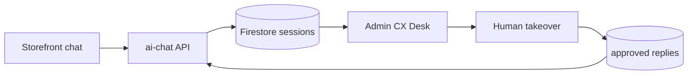

# Premium CX desk

Purpose: shopkeeper supervises AI customer chats - Premium tier beyond storefront bubble.

Paths (today): `src/components/AIAssistant.tsx`, `api/ai-chat.ts`

Deps (future): Firestore chat sessions, admin desk UI, knowledge store, OpenAI or equivalent

## ROI read for CABA / Zona Norte pymes

Best near-term offer: **Premium CX Lite**, not a full CX desk.

Target buyer: rotiseria, empanadas, burger/chori, food truck, cafe chico, pet shop, dietetica, fiambreria or specialty retail where the owner answers WhatsApp personally and loses time on repeated questions.

Best-fit geography: CABA and Zona Norte shops close enough for setup/support visits: Palermo, Belgrano, Nunez, Colegiales, Vicente Lopez, Olivos, Martinez, San Isidro.

### What to sell now

Position it as:

> "Te armamos carta/pedidos online + respuestas rapidas para WhatsApp + asistente para preguntas comunes. Sin comision por pedido. Vos mantenes control."

Package:

- Existing storefront with cart, checkout, order status and WhatsApp handoff.
- Existing admin order inbox with sound, 58mm ticket and quick replies.
- Premium assistant for menu Q&A and suggestions on the storefront.
- Admin-configured WhatsApp templates for recurring replies.
- Manual "known answers" setup during onboarding: delivery zones, hours, payment methods, promos, allergens, top combos.
- Weekly improvement pass during first month based on real customer questions.

Do **not** lead with "AI customer service desk". For local pymes that sounds risky and expensive. Lead with fewer messy WhatsApp chats, fewer repeated questions, cleaner orders and no marketplace commission.

### Why this is probably best ROI

High value:

- Owners already feel WhatsApp pain.
- Orders and customer questions are concrete daily problems.
- "No commission" is easy to compare against marketplaces and PedidoDirecto-like tools.
- In-person setup in CABA/Zona Norte is a trust advantage.

Low build cost:

- Reuses current Pedidos features.
- Reuses Premium storefront chat.
- Reuses `wa.me` instead of WhatsApp Business API.
- Requires mostly onboarding content, templates and small admin polish.

Fast sales proof:

- Can be piloted with 2 shops in 1-2 weeks.
- Success metric is observable: order volume, owner admin usage, fewer malformed WhatsApp orders, repeat questions handled.

### Recommended pricing test

Use simple pricing until there are 5+ paying shops:

| Offer | Setup | Monthly | Notes |
|---|---:|---:|---|
| Pedidos | $0 pilot / setup included | ARS 15k-18k | Current baseline |
| Premium CX Lite | ARS 20k-40k optional | ARS 25k-35k | Best ROI test |
| Full CX Desk | Custom | ARS 60k+ | Only after demand is proven |

Discount rule: waive setup for first 2 pilots if they allow a case study and introduce one neighbor.

### What not to build yet

- Real-time multi-chat admin inbox.
- Human takeover inside the website chat.
- WhatsApp Business API ingestion.
- RAG knowledge base UI.
- SLA timers, agent routing, CRM exports.

Those are credible later, but too much surface area before proving that pymes will pay more than Pedidos for CX help.

### MVP increments for Premium CX Lite

1. **CX onboarding worksheet**: one Markdown/checklist per tenant with hours, zones, FAQs, payment rules, top combos and "ask human" cases.
2. **Admin quick replies polish**: make order templates feel like a feature, not a utility.
3. **Assistant prompt hardening**: tenant FAQ/context injected into `/api/ai-chat` from config or Firestore.
4. **Escalation copy**: when unsure, assistant says it will send the customer to WhatsApp with the order/question prefilled.
5. **Metrics note**: track repeated questions and malformed orders during pilot.

### Pilot script

For the next 2 pilots, sell this as an upgrade option:

1. Start them on Pedidos.
2. During week 1, collect repeated WhatsApp questions and menu confusion.
3. Turn those into Premium CX Lite content/templates.
4. In week 2, show before/after: fewer corrections, faster replies, better order text.
5. Ask whether they would pay ARS 25k-35k/month to keep it.

Decision gate: build the full CX desk only after at least 3 shops say they want to monitor AI chats inside admin and would pay a clear premium for it.

## Today

- Floating storefront chat (Premium only)
- Stateless-ish turns via `/api/ai-chat`
- No admin visibility, no human takeover, no learning from corrections

## Future spec

### Shopkeeper UI

- **~10 concurrent chat windows** (customer sessions) in admin
- Real-time view of customer <-> agent messages
- Session list: active, waiting human, closed
- Takeover button: human types; customer sees reply in storefront chat

### Agent behavior

- AI handles menu Q&A, cart suggestions (existing flow)
- **Highlight** messages flagged for human:
  - Low model confidence
  - Complaint / refund / payment dispute keywords
  - Custom requests outside menu
  - Explicit "hablar con alguien"
- Highlighted lines styled differently in desk UI

### Human memory (bounded)

- When human sends a correction or approved reply, save to tenant **knowledge**:
  - Approved FAQ pairs
  - Few-shot examples for system prompt
  - NOT unrestricted fine-tuning on all chat logs
- Admin can review/delete saved entries
- RAG retrieval on next similar question

## Architecture



## Data shape (sketch)

```text
tenants/{id}/chatSessions/{sessionId}
  messages[], status, customerPhone, orderId?, needsHuman
tenants/{id}/cxKnowledge/{entryId}
  question, approvedAnswer, createdBy, createdAt
```

## Out of scope v1

- Full CRM, unlimited export
- Multi-agent routing, SLA timers
- WhatsApp thread merge (see whatsapp-cx.md separately)

See also: [../features/ai-assistant.md](../features/ai-assistant.md), [phases.md](./phases.md)
