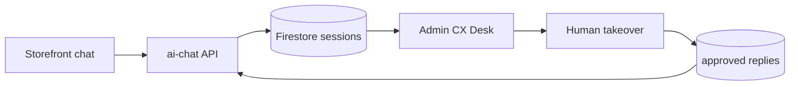

# Premium CX desk

Purpose: shopkeeper supervises AI customer chats — Premium tier beyond storefront bubble.

Paths (today): `src/components/AIAssistant.tsx`, `api/ai-chat.ts`

Deps (future): Firestore chat sessions, admin desk UI, knowledge store, OpenAI or equivalent

## Today

- Floating storefront chat (Premium only)
- Stateless-ish turns via `/api/ai-chat`
- No admin visibility, no human takeover, no learning from corrections

## Future spec

### Shopkeeper UI

- **~10 concurrent chat windows** (customer sessions) in admin
- Real-time view of customer ↔ agent messages
- Session list: active, waiting human, closed
- Takeover button: human types; customer sees reply in storefront chat

### Agent behavior

- AI handles menu Q&A, cart suggestions (existing flow)
- **Highlight** messages flagged for human:
  - Low model confidence
  - Complaint / refund / payment dispute keywords
  - Custom requests outside menu
  - Explicit "hablar con alguien"
- Highlighted lines styled differently in desk UI

### Human memory (bounded)

- When human sends a correction or approved reply, save to tenant **knowledge**:
  - Approved FAQ pairs
  - Few-shot examples for system prompt
  - NOT unrestricted fine-tuning on all chat logs
- Admin can review/delete saved entries
- RAG retrieval on next similar question

## Architecture



## Data shape (sketch)

```
tenants/{id}/chatSessions/{sessionId}
  messages[], status, customerPhone, orderId?, needsHuman
tenants/{id}/cxKnowledge/{entryId}
  question, approvedAnswer, createdBy, createdAt
```

## Out of scope v1

- Full CRM, unlimited export
- Multi-agent routing, SLA timers
- WhatsApp thread merge (see whatsapp-cx.md separately)

See also: [../features/ai-assistant.md](../features/ai-assistant.md), [phases.md](./phases.md)
